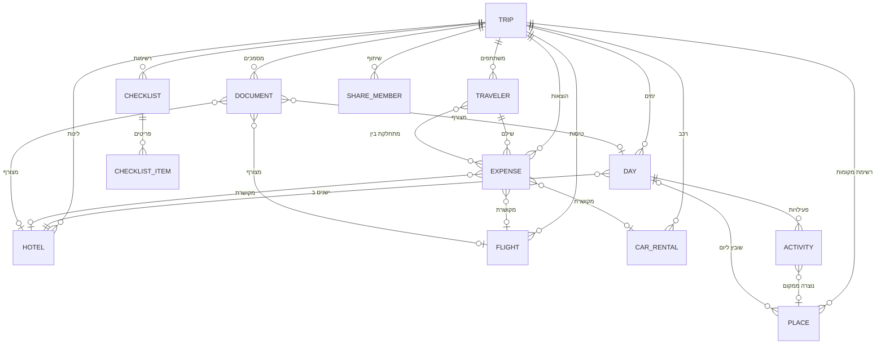

# מודל הנתונים

המודל מוגדר ב-[`src/lib/types.ts`](../src/lib/types.ts). כל ישות היא רשומה שטוחה עם מזהה מחרוזת
וקשרים במפתחות זרים, כך שאותן צורות בדיוק ממופות 1:1 לטבלאות SQL. המסמך הזה הוא הסכימה
המקבילה, למי שירצה להחליף את `LocalStorageRepository` במימוש Supabase/Postgres.

## תרשים קשרים



## טבלאות

### `trips`

| עמודה | טיפוס | הערות |
| --- | --- | --- |
| `id` | text PK | |
| `name` | text | |
| `destination` | text | |
| `country_code` | char(2) | לדגל בכרטיס הטיול |
| `cover_image` | text | מפתח לרקע המצויר (`greece`, `coast`, …) |
| `start_date` / `end_date` | date | |
| `base_currency` | text | מטבע הטיול |
| `total_budget` | numeric | |
| `currencies` | text[] | כולל תמיד את `base_currency` |
| `rates` | jsonb | `{ EUR: 4.1 }` — כמה יחידות מטבע הבסיס שווה יחידה אחת |
| `rates_updated_at` | timestamptz | |
| `rates_source` | text | `manual` \| `api` |
| `route` | text[] | היעדים המרכזיים, לקו המסלול במפה |
| `notes` | text | |
| `created_at` / `updated_at` | timestamptz | |

### `travelers`

`id` PK · `trip_id` FK → trips · `name` · `color` · `email` · `is_owner` bool

### `days`

`id` PK · `trip_id` FK · `date` · `index` int · `title` · `base_location` · `hotel_id` FK → hotels ·
`notes` · `planned_budget` numeric

> `hotel_id` הוא שיוך מפורש. כשהוא ריק, המלון נגזר מטווח ה-check-in/check-out.

### `activities`

`id` PK · `trip_id` FK · `day_id` FK → days · `title` · `category` · `start_time` time ·
`duration_min` int · `address` · `lat` / `lng` · `price` numeric · `currency` · `notes` · `url` ·
`image` · `booking_ref` · `booked` bool · `done` bool · `order` int · `place_id` FK → places

`category` ∈ `hotel | food | drive | nature | attraction | shopping | beach | winery | activity |
coffee | flight | other`

> `start_time` ריק = פעילות ללא שעה. `order` קובע סדר בתוך היום כשאין שעות או כשיש שוויון.

### `hotels`

`id` PK · `trip_id` FK · `name` · `city` · `address` · `lat` / `lng` · `check_in` / `check_out` date ·
`check_in_time` / `check_out_time` time · `price_per_night` · `total_price` · `currency` · `rooms` ·
`guests` · `booking_url` · `booking_ref` · `cancellation_policy` · `notes` · `images` text[] ·
`booked` bool · `paid` bool

### `flights`

`id` PK · `trip_id` FK · `direction` (`outbound|return|internal`) · `airline` · `flight_number` ·
`date` · `departure_time` / `arrival_time` · `arrives_next_day` bool · `from` jsonb · `to` jsonb ·
`baggage` · `seats` · `price` · `currency` · `price_is_per_person` bool · `booking_ref` ·
`booking_url` · `notes` · `booked` bool · `paid` bool

`from` / `to` = `{ code, name, city, terminal, location }`.

### `car_rentals`

`id` PK · `trip_id` FK · `company` · `car_type` · `pickup_date` / `pickup_time` /
`pickup_location` / `pickup_point` · `dropoff_*` (אותו הדבר) · `price` · `currency` · `insurance` ·
`deductible` · `booking_ref` · `booking_url` · `notes` · `booked` · `paid` ·
`fuel_consumption` (ל׳/100ק״מ) · `fuel_price_per_liter`

### `places`

`id` PK · `trip_id` FK · `name` · `list` · `category` · `address` · `lat` / `lng` · `image` ·
`rating` · `notes` · `price` · `currency` · `url` · `day_id` FK → days · `created_at`

`list` ∈ `must | if-time | restaurants | coffee | nature | beaches | wineries`

### `expenses`

`id` PK · `trip_id` FK · `date` · `category` · `description` · `amount` · `currency` · `paid` bool ·
`paid_by_id` FK → travelers · `split_between` text[] (FK → travelers) · `notes` ·
`linked_type` (`hotel|flight|car|activity`) · `linked_id` · `created_at`

`category` ∈ `flights | hotels | car | fuel | food | attractions | shopping | ferries | coffee |
other`

> בסכימה יחסית מלאה `split_between` הופך לטבלת קישור `expense_participants(expense_id,
> traveler_id)`. המערך נשמר כאן כי חלוקה שווה היא המקרה היחיד שהאפליקציה תומכת בו.

### `documents`

`id` PK · `trip_id` FK · `name` · `category` · `date` · `url` · `file_key` · `mime_type` · `size` ·
`notes` · `linked_type` (`hotel|flight|car|activity|day`) · `linked_id` · `created_at`

> `file_key` מפנה לאחסון הבינארי. בגרסה המקומית זה מפתח ב-IndexedDB; מול Supabase זה נתיב
> ב-Storage bucket.

### `checklists` / `checklist_items`

`checklists`: `id` PK · `trip_id` FK · `title` · `group` · `created_at`
`checklist_items`: `id` PK · `checklist_id` FK · `text` · `done` bool · `assignee_id` FK → travelers

> באחסון המקומי הפריטים מקוננים בתוך הרשימה; ב-SQL הם טבלה נפרדת.

### `share_members`

`id` PK · `trip_id` FK · `name` · `email` · `permission` (`view|edit`) · `status`
(`pending|active`) · `invited_at`

## `bookings` — תצוגה, לא טבלה

״הזמנות״ אינן טבלה בפני עצמה. `booked` / `paid` / `booking_ref` יושבים על הישות שאליה הם
שייכים — מלון, טיסה, רכב או פעילות — כדי שלא יהיו שני מקורות אמת לאותה שאלה.
`computeBookings()` ב-[`src/lib/selectors/alerts.ts`](../src/lib/selectors/alerts.ts) מאחד אותם
לתצוגה אחת. ב-SQL זה יהיה `CREATE VIEW bookings AS SELECT … UNION ALL …`.

## אינדקסים מומלצים

```sql
CREATE INDEX ON days (trip_id, date);
CREATE INDEX ON activities (day_id, start_time);
CREATE INDEX ON activities (trip_id);
CREATE INDEX ON hotels (trip_id, check_in);
CREATE INDEX ON flights (trip_id, date);
CREATE INDEX ON expenses (trip_id, date);
CREATE INDEX ON expenses (trip_id, category);
CREATE INDEX ON places (trip_id, list);
CREATE INDEX ON documents (trip_id, category);
```

## מחיקות מדורגות

מחיקת טיול מוחקת את כל הישויות התלויות (`ON DELETE CASCADE`). מחיקת מלון או מטייל **לא**
מוחקת הוצאות — היא רק מנקה את ההפניה, כדי שהיסטוריית התשלומים לא תיעלם. אותה התנהגות
בדיוק ממומשת ב-`deleteHotel` ו-`removeTraveler` שב-store.
